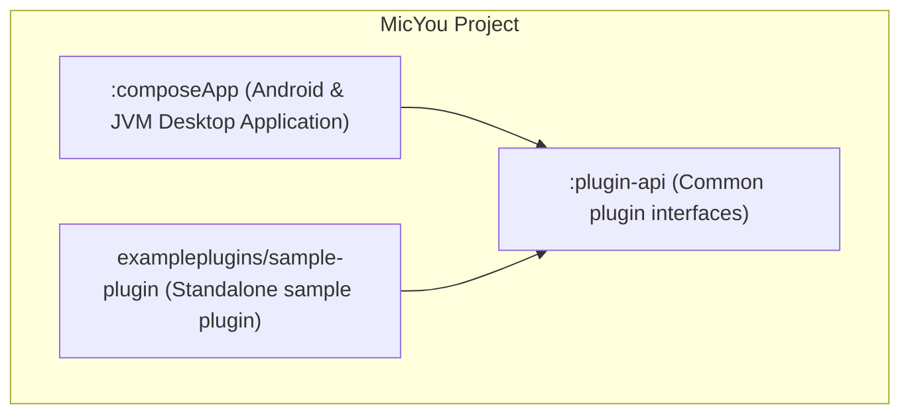

# MicYou 桌面端迁移 (Tauri v2 + Vue 3) 代码库分析报告

本报告对 MicYou 现有的 Kotlin Multiplatform 桌面端服务端代码进行了系统性分析，以便为后续迁移至 Tauri v2 (Rust) + Vue 3 架构提供技术参考。

---

## 1. 模块依赖关系图 (Module Dependency)

项目主要包含三个模块：宿主应用 `:composeApp`、通用的插件接口库 `:plugin-api`，以及示例插件项目 `sample-plugin`。



---

## 2. Kotlin 文件核心职责清单

### A. 插件 API 接口 (`:plugin-api`)
* [AudioEffectPlugin.kt](file:///d:/AndroidStudioProjects/MicYou/plugin-api/src/commonMain/kotlin/com/lanrhyme/micyou/plugin/AudioEffectPlugin.kt): 定义音频处理插件的标准生命周期接口。
* [AudioEffectProvider.kt](file:///d:/AndroidStudioProjects/MicYou/plugin-api/src/commonMain/kotlin/com/lanrhyme/micyou/plugin/AudioEffectProvider.kt): 定义向宿主提供具体音频效果处理器的接口。
* [Plugin.kt](file:///d:/AndroidStudioProjects/MicYou/plugin-api/src/commonMain/kotlin/com/lanrhyme/micyou/plugin/Plugin.kt): 定义所有外部插件的通用基础生命周期元数据接口。
* [PluginContext.kt](file:///d:/AndroidStudioProjects/MicYou/plugin-api/src/commonMain/kotlin/com/lanrhyme/micyou/plugin/PluginContext.kt): 封装插件运行时的上下文（存储、UI 桥接、语言环境等）。
* [PluginDataChannel.kt](file:///d:/AndroidStudioProjects/MicYou/plugin-api/src/commonMain/kotlin/com/lanrhyme/micyou/plugin/PluginDataChannel.kt): 定义插件与宿主或其他插件之间的跨边界通信通道接口。
* [PluginHost.kt](file:///d:/AndroidStudioProjects/MicYou/plugin-api/src/commonMain/kotlin/com/lanrhyme/micyou/plugin/PluginHost.kt): 定义宿主向插件公开的系统服务接口。
* [PluginInfo.kt](file:///d:/AndroidStudioProjects/MicYou/plugin-api/src/commonMain/kotlin/com/lanrhyme/micyou/plugin/PluginInfo.kt): 描述插件元信息的数据类。
* [PluginLocalization.kt](file:///d:/AndroidStudioProjects/MicYou/plugin-api/src/commonMain/kotlin/com/lanrhyme/micyou/plugin/PluginLocalization.kt): 定义插件访问宿主语言环境的接口。
* [PluginManifest.kt](file:///d:/AndroidStudioProjects/MicYou/plugin-api/src/commonMain/kotlin/com/lanrhyme/micyou/plugin/PluginManifest.kt): 插件 `manifest.json` 解析出的配置清单数据结构。
* [PluginPlatform.kt](file:///d:/AndroidStudioProjects/MicYou/plugin-api/src/commonMain/kotlin/com/lanrhyme/micyou/plugin/PluginPlatform.kt): 描述当前运行平台的参数数据结构。
* [PluginSettingsProvider.kt](file:///d:/AndroidStudioProjects/MicYou/plugin-api/src/commonMain/kotlin/com/lanrhyme/micyou/plugin/PluginSettingsProvider.kt): 插件提供自定义设置页面元信息的接口。
* [PluginUIProvider.kt](file:///d:/AndroidStudioProjects/MicYou/plugin-api/src/commonMain/kotlin/com/lanrhyme/micyou/plugin/PluginUIProvider.kt): 插件向宿主提供自定义 UI 渲染树的接口。

### B. 宿主通用核心逻辑 (`:composeApp/src/commonMain`)
* [MonitoringMetricsHistory.kt](file:///d:/AndroidStudioProjects/MicYou/composeApp/src/commonMain/kotlin/com/lanrhyme/micyou/MonitoringMetricsHistory.kt): 线程安全地存储并缓冲延迟/抖动指标历史以便 UI 绘图。
* [MonitoringPanel.kt](file:///d:/AndroidStudioProjects/MicYou/composeApp/src/commonMain/kotlin/com/lanrhyme/micyou/MonitoringPanel.kt): 渲染流实时指标数据和延迟趋势图的 Compose UI 面板。
* [OpenSourceLibraries.kt](file:///d:/AndroidStudioProjects/MicYou/composeApp/src/commonMain/kotlin/com/lanrhyme/micyou/OpenSourceLibraries.kt): 渲染第三方开源库许可证清单的 UI 页面。
* [PerformanceConfig.kt](file:///d:/AndroidStudioProjects/MicYou/composeApp/src/commonMain/kotlin/com/lanrhyme/micyou/PerformanceConfig.kt): 定义缓冲区容量和扩容参数的数据结构。
* [Platform.kt](file:///d:/AndroidStudioProjects/MicYou/composeApp/src/commonMain/kotlin/com/lanrhyme/micyou/Platform.kt): 声明各平台差异性能力（如 IP、剪贴板、驱动安装等）的 `expect` 接口与跨平台日志入口。
* [PlatformAdaptor.kt](file:///d:/AndroidStudioProjects/MicYou/composeApp/src/commonMain/kotlin/com/lanrhyme/micyou/PlatformAdaptor.kt): 声明平台特定的 UI 窗口自适应参数与特效。
* [PluginFileChooser.kt](file:///d:/AndroidStudioProjects/MicYou/composeApp/src/commonMain/kotlin/com/lanrhyme/micyou/PluginFileChooser.kt): 声明跨平台选择插件文件的 `expect` 接口。
* [PluginHostProvider.kt](file:///d:/AndroidStudioProjects/MicYou/composeApp/src/commonMain/kotlin/com/lanrhyme/micyou/PluginHostProvider.kt): 提供全局插件宿主实现的静态持有类。
* [PluginListPopup.kt](file:///d:/AndroidStudioProjects/MicYou/composeApp/src/commonMain/kotlin/com/lanrhyme/micyou/PluginListPopup.kt): 渲染插件安装、卸载、开关和设置的管理弹窗 UI。
* [PluginManagerProvider.kt](file:///d:/AndroidStudioProjects/MicYou/composeApp/src/commonMain/kotlin/com/lanrhyme/micyou/PluginManagerProvider.kt): 提供全局插件管理器实例的静态持有类。
* [PluginSettingsContent.kt](file:///d:/AndroidStudioProjects/MicYou/composeApp/src/commonMain/kotlin/com/lanrhyme/micyou/PluginSettingsContent.kt): 声明渲染插件内部独立配置 UI 的 `expect` 组件。
* [PluginSyncWarningDialog.kt](file:///d:/AndroidStudioProjects/MicYou/composeApp/src/commonMain/kotlin/com/lanrhyme/micyou/PluginSyncWarningDialog.kt): 提醒用户客户端与服务端插件状态不同步的警告弹窗。
* [PluginViewModel.kt](file:///d:/AndroidStudioProjects/MicYou/composeApp/src/commonMain/kotlin/com/lanrhyme/micyou/PluginViewModel.kt): 控制插件交互逻辑与清单数据流绑定的架构模型。
* [Protocol.kt](file:///d:/AndroidStudioProjects/MicYou/composeApp/src/commonMain/kotlin/com/lanrhyme/micyou/Protocol.kt): 定义网络报文的魔数、Protobuf 序列化协议以及数据封装类。
* [Settings.kt](file:///d:/AndroidStudioProjects/MicYou/composeApp/src/commonMain/kotlin/com/lanrhyme/micyou/Settings.kt): 声明轻量级键值存储持久化的 `expect` 接口。
* [SettingsViewModel.kt](file:///d:/AndroidStudioProjects/MicYou/composeApp/src/commonMain/kotlin/com/lanrhyme/micyou/SettingsViewModel.kt): 持有并控制应用级所有常规偏好配置的数据架构模型。
* [ShardTextField.kt](file:///d:/AndroidStudioProjects/MicYou/composeApp/src/commonMain/kotlin/com/lanrhyme/micyou/ShardTextField.kt): 自定义圆角带模糊质感的基础输入框通用 UI 组分。
* [SpectrumAnalyzerView.kt](file:///d:/AndroidStudioProjects/MicYou/composeApp/src/commonMain/kotlin/com/lanrhyme/micyou/SpectrumAnalyzerView.kt): 负责将傅里叶变换后的频域振幅绘制成实时波动波形图的 Compose Canvas 组分。
* [SponsorDialog.kt](file:///d:/AndroidStudioProjects/MicYou/composeApp/src/commonMain/kotlin/com/lanrhyme/micyou/SponsorDialog.kt): 渲染发电赞助和作者打赏入口的 UI 弹窗。
* [Theme.kt](file:///d:/AndroidStudioProjects/MicYou/composeApp/src/commonMain/kotlin/com/lanrhyme/micyou/Theme.kt): 配置全局 Material 3 基础及扩展主题色彩架构。
* [UpdateChecker.kt](file:///d:/AndroidStudioProjects/MicYou/composeApp/src/commonMain/kotlin/com/lanrhyme/micyou/UpdateChecker.kt): 声明远程版本检查与下载的 `expect` 辅助类。
* [UpdateViewModel.kt](file:///d:/AndroidStudioProjects/MicYou/composeApp/src/commonMain/kotlin/com/lanrhyme/micyou/UpdateViewModel.kt): 控制版本检测生命周期与下载进度的 UI 状态架构。
* [AdvancedAnimations.kt](file:///d:/AndroidStudioProjects/MicYou/composeApp/src/commonMain/kotlin/com/lanrhyme/micyou/animation/AdvancedAnimations.kt): 提供高级 UI 状态插值与弹性动画效果。
* [TransitionAnimations.kt](file:///d:/AndroidStudioProjects/MicYou/composeApp/src/commonMain/kotlin/com/lanrhyme/micyou/animation/TransitionAnimations.kt): 定义默认组件与页面跳转的淡入淡出动效。
* [VisualEffects.kt](file:///d:/AndroidStudioProjects/MicYou/composeApp/src/commonMain/kotlin/com/lanrhyme/micyou/animation/VisualEffects.kt): 提供亚克力模糊、卡片投影等视觉样式定义。
* [BasePluginHostImpl.kt](file:///d:/AndroidStudioProjects/MicYou/composeApp/src/commonMain/kotlin/com/lanrhyme/micyou/plugin/BasePluginHostImpl.kt): 实现插件宿主基础通用状态与日志路由服务。
* [ExpressiveColorScheme.kt](file:///d:/AndroidStudioProjects/MicYou/composeApp/src/commonMain/kotlin/com/lanrhyme/micyou/theme/ExpressiveColorScheme.kt): 生成高表现力的定制颜色卡片色板。
* [ExpressiveComponents.kt](file:///d:/AndroidStudioProjects/MicYou/composeApp/src/commonMain/kotlin/com/lanrhyme/micyou/theme/ExpressiveComponents.kt): 定义一系列具备现代玻璃化拟物感的通用按钮、标签及卡片组分。
* [ExpressiveShapes.kt](file:///d:/AndroidStudioProjects/MicYou/composeApp/src/commonMain/kotlin/com/lanrhyme/micyou/theme/ExpressiveShapes.kt): 声明统一的圆角和形状资源标准。

### C. 桌面端宿主核心逻辑 (`:composeApp/src/jvmMain`)
* [AudioEngine.jvm.kt](file:///d:/AndroidStudioProjects/MicYou/composeApp/src/jvmMain/kotlin/com/lanrhyme/micyou/AudioEngine.jvm.kt): 核心类，实际协调 JVM 上 TCP/UDP 通道、音频采集与写入流程及后台重构参数。
* [BackgroundImagePicker.jvm.kt](file:///d:/AndroidStudioProjects/MicYou/composeApp/src/jvmMain/kotlin/com/lanrhyme/micyou/BackgroundImagePicker.jvm.kt): JVM 平台上读取和裁剪本地背景图的机制。
* [BackHandlerCompat.jvm.kt](file:///d:/AndroidStudioProjects/MicYou/composeApp/src/jvmMain/kotlin/com/lanrhyme/micyou/BackHandlerCompat.jvm.kt): JVM 平台上空白的导航返回行为兼容包装。
* [CloseConfirmDialog.kt](file:///d:/AndroidStudioProjects/MicYou/composeApp/src/jvmMain/kotlin/com/lanrhyme/micyou/CloseConfirmDialog.kt): 应用退出时的逻辑提示弹窗。
* [DeviceDiscovery.jvm.kt](file:///d:/AndroidStudioProjects/MicYou/composeApp/src/jvmMain/kotlin/com/lanrhyme/micyou/DeviceDiscovery.jvm.kt): 桌面端专用的空白设备发现类（作为服务端无需主动发现手机）。
* [FloatingMicWindow.kt](file:///d:/AndroidStudioProjects/MicYou/composeApp/src/jvmMain/kotlin/com/lanrhyme/micyou/FloatingMicWindow.kt): JVM 平台小悬浮球窗口的构建与交互实现。
* [LoadImageBitmap.jvm.kt](file:///d:/AndroidStudioProjects/MicYou/composeApp/src/jvmMain/kotlin/com/lanrhyme/micyou/LoadImageBitmap.jvm.kt): 从本地文件流或 Jar 资源中加载 Bitmap 的 JVM 实现。
* [Localization.jvm.kt](file:///d:/AndroidStudioProjects/MicYou/composeApp/src/jvmMain/kotlin/com/lanrhyme/micyou/Localization.jvm.kt): JVM 桌面系统语言环境映射逻辑。
* [main.kt](file:///d:/AndroidStudioProjects/MicYou/composeApp/src/jvmMain/kotlin/com/lanrhyme/micyou/main.kt): 桌面应用程序的主程序启动入口与窗口框架引导。
* [PermissionDialog.jvm.kt](file:///d:/AndroidStudioProjects/MicYou/composeApp/src/jvmMain/kotlin/com/lanrhyme/micyou/PermissionDialog.jvm.kt): 桌面端权限检测空实现与备用指引对话框。
* [Platform.jvm.kt](file:///d:/AndroidStudioProjects/MicYou/composeApp/src/jvmMain/kotlin/com/lanrhyme/micyou/Platform.jvm.kt): 对接 JVM 平台底层逻辑（如 IP 检索、防火墙指令、音频输入选择等）。
* [PlatformAdaptor.jvm.kt](file:///d:/AndroidStudioProjects/MicYou/composeApp/src/jvmMain/kotlin/com/lanrhyme/micyou/PlatformAdaptor.jvm.kt): 实现 JVM 平台的亚克力毛玻璃滤镜和窗口拖拽边缘检测。
* [PluginFileChooser.jvm.kt](file:///d:/AndroidStudioProjects/MicYou/composeApp/src/jvmMain/kotlin/com/lanrhyme/micyou/PluginFileChooser.jvm.kt): 基于本地文件对话框的选择器实现。
* [PluginHostProvider.jvm.kt](file:///d:/AndroidStudioProjects/MicYou/composeApp/src/jvmMain/kotlin/com/lanrhyme/micyou/PluginHostProvider.jvm.kt): JVM 平台上提供插件宿主服务的容器。
* [PluginManagerProvider.jvm.kt](file:///d:/AndroidStudioProjects/MicYou/composeApp/src/jvmMain/kotlin/com/lanrhyme/micyou/PluginManagerProvider.jvm.kt): JVM 平台上控制插件扫描和注册的管理入口。
* [PluginSettingsContent.jvm.kt](file:///d:/AndroidStudioProjects/MicYou/composeApp/src/jvmMain/kotlin/com/lanrhyme/micyou/PluginSettingsContent.jvm.kt): 负责在 JVM 环境下编译并呈现插件 UI 内容。
* [Settings.jvm.kt](file:///d:/AndroidStudioProjects/MicYou/composeApp/src/jvmMain/kotlin/com/lanrhyme/micyou/Settings.jvm.kt): JVM 平台本地文件级偏好设置存储。
* [UpdateChecker.jvm.kt](file:///d:/AndroidStudioProjects/MicYou/composeApp/src/jvmMain/kotlin/com/lanrhyme/micyou/UpdateChecker.jvm.kt): JVM 平台的 GitHub Release 更新查询和浏览器端下载跳转。
* [VirtualAudioDeviceManager.kt](file:///d:/AndroidStudioProjects/MicYou/composeApp/src/jvmMain/kotlin/com/lanrhyme/micyou/VirtualAudioDeviceManager.kt): 封装虚拟声卡驱动 VB-Cable 的静默安装指令与状态逻辑。
* [AGCEffect.kt](file:///d:/AndroidStudioProjects/MicYou/composeApp/src/jvmMain/kotlin/com/lanrhyme/micyou/audio/AGCEffect.kt): 音频处理：自动增益控制实现（AGC）。
* [AmplifierEffect.kt](file:///d:/AndroidStudioProjects/MicYou/composeApp/src/jvmMain/kotlin/com/lanrhyme/micyou/audio/AmplifierEffect.kt): 音频处理：乘法系数音频信号放大。
* [AudioEffect.kt](file:///d:/AndroidStudioProjects/MicYou/composeApp/src/jvmMain/kotlin/com/lanrhyme/micyou/audio/AudioEffect.kt): 音频处理：音效基类及通用数据传输包装。
* [AudioOutputManager.kt](file:///d:/AndroidStudioProjects/MicYou/composeApp/src/jvmMain/kotlin/com/lanrhyme/micyou/audio/AudioOutputManager.kt): 负责通过 Java Sound API (SourceDataLine) 连接物理或虚拟声卡并输出音频。
* [AudioProcessingException.kt](file:///d:/AndroidStudioProjects/MicYou/composeApp/src/jvmMain/kotlin/com/lanrhyme/micyou/audio/AudioProcessingException.kt): 异常处理：定义音频 DSP 抛出的异常。
* [AudioProcessorPipeline.kt](file:///d:/AndroidStudioProjects/MicYou/composeApp/src/jvmMain/kotlin/com/lanrhyme/micyou/audio/AudioProcessorPipeline.kt): 按顺序流水线执行降噪、AGC、EQ、VAD、放大等多个音效组件。
* [AudioSpectrumAnalyzer.kt](file:///d:/AndroidStudioProjects/MicYou/composeApp/src/jvmMain/kotlin/com/lanrhyme/micyou/audio/AudioSpectrumAnalyzer.kt): 使用 FFT 库（JTransforms）进行频域转换，用于实时频谱展示。
* [DereverbEffect.kt](file:///d:/AndroidStudioProjects/MicYou/composeApp/src/jvmMain/kotlin/com/lanrhyme/micyou/audio/DereverbEffect.kt): 音频处理：混响去除效果（去回声）。
* [EqualizerEffect.kt](file:///d:/AndroidStudioProjects/MicYou/composeApp/src/jvmMain/kotlin/com/lanrhyme/micyou/audio/EqualizerEffect.kt): 音频处理：多频段 IIR 滤波器均衡器。
* [NoiseReducer.kt](file:///d:/AndroidStudioProjects/MicYou/composeApp/src/jvmMain/kotlin/com/lanrhyme/micyou/audio/NoiseReducer.kt): 音频处理：基于 `rnnoise4j` 的智能降噪。
* [ResamplerEffect.kt](file:///d:/AndroidStudioProjects/MicYou/composeApp/src/jvmMain/kotlin/com/lanrhyme/micyou/audio/ResamplerEffect.kt): 音频处理：将采样率线性或插值重采样至输出设备要求格式。
* [UlunasProcessor.kt](file:///d:/AndroidStudioProjects/MicYou/composeApp/src/jvmMain/kotlin/com/lanrhyme/micyou/audio/UlunasProcessor.kt): DSP 核心：支持频谱系数运算和音强检测的算法集。
* [VADEffect.kt](file:///d:/AndroidStudioProjects/MicYou/composeApp/src/jvmMain/kotlin/com/lanrhyme/micyou/audio/VADEffect.kt): 音频处理：静音门限检测（Voice Activity Detection），静音时丢弃包防止底噪。
* [ConnectionHandler.kt](file:///d:/AndroidStudioProjects/MicYou/composeApp/src/jvmMain/kotlin/com/lanrhyme/micyou/network/ConnectionHandler.kt): 网络核心：处理 TCP 控制链路，执行 Handshake 认证、Ping-Pong RTT 统计与控制报文收发。
* [IosConnectionHandler.kt](file:///d:/AndroidStudioProjects/MicYou/composeApp/src/jvmMain/kotlin/com/lanrhyme/micyou/network/IosConnectionHandler.kt): iOS支持：解析 iOS 客户端独特的二进制帧协议并实现心跳检测。
* [IosProtocol.kt](file:///d:/AndroidStudioProjects/MicYou/composeApp/src/jvmMain/kotlin/com/lanrhyme/micyou/network/IosProtocol.kt): 存储并定义 iOS 控制和音频帧格式常数。
* [JitterBuffer.kt](file:///d:/AndroidStudioProjects/MicYou/composeApp/src/jvmMain/kotlin/com/lanrhyme/micyou/network/JitterBuffer.kt): 抖动缓冲器：管理 UDP 接收乱序、去重、支持窗口延迟校正与前向纠错（FEC）还原。
* [LocalNetworkAddressProvider.kt](file:///d:/AndroidStudioProjects/MicYou/composeApp/src/jvmMain/kotlin/com/lanrhyme/micyou/network/LocalNetworkAddressProvider.kt): 提供局域网内当前有效 IP 及其网络接口名遍历。
* [MdnsAdvertiser.kt](file:///d:/AndroidStudioProjects/MicYou/composeApp/src/jvmMain/kotlin/com/lanrhyme/micyou/network/MdnsAdvertiser.kt): 服务广播：使用 JmDNS 组播宣告 `_micyou._tcp.local.` 服务以供 Android 端发现。
* [NetworkAddressMonitor.kt](file:///d:/AndroidStudioProjects/MicYou/composeApp/src/jvmMain/kotlin/com/lanrhyme/micyou/network/NetworkAddressMonitor.kt): 监测网卡 IP 改变事件，变化时通知上层服务热重启。
* [NetworkServer.kt](file:///d:/AndroidStudioProjects/MicYou/composeApp/src/jvmMain/kotlin/com/lanrhyme/micyou/network/NetworkServer.kt): 套接字绑定：基于 Ktor Network 封装的 TCP 与 UDP 双协议服务器。
* [SelfSignedCertificate.kt](file:///d:/AndroidStudioProjects/MicYou/composeApp/src/jvmMain/kotlin/com/lanrhyme/micyou/network/SelfSignedCertificate.kt): 生成临时自签名 SSL 证书以启用 HTTPS 局域网服务。
* [UdpConnectionHandler.kt](file:///d:/AndroidStudioProjects/MicYou/composeApp/src/jvmMain/kotlin/com/lanrhyme/micyou/network/UdpConnectionHandler.kt): 接收高吞吐量 UDP 音频原始包并计算丢包率和抖动指标。
* [WebHtmlPage.kt](file:///d:/AndroidStudioProjects/MicYou/composeApp/src/jvmMain/kotlin/com/lanrhyme/micyou/network/WebHtmlPage.kt): 缓存并提供连接用 Web 页面（H5 麦克风前端）的静态资源代码。
* [WebServer.kt](file:///d:/AndroidStudioProjects/MicYou/composeApp/src/jvmMain/kotlin/com/lanrhyme/micyou/network/WebServer.kt): 启用 Netty 宿主，接收浏览器（HTML5 麦克风）发来的 WebSocket 音频帧。
* [AdbManager.kt](file:///d:/AndroidStudioProjects/MicYou/composeApp/src/jvmMain/kotlin/com/lanrhyme/micyou/platform/AdbManager.kt): 调用系统 adb 工具注册 `reverse` 反向映射，辅助 USB 模式数据连接。
* [BlackHoleManager.kt](file:///d:/AndroidStudioProjects/MicYou/composeApp/src/jvmMain/kotlin/com/lanrhyme/micyou/platform/BlackHoleManager.kt): macOS 黑洞驱动的底层生命周期映射桩。
* [FirewallManager.kt](file:///d:/AndroidStudioProjects/MicYou/composeApp/src/jvmMain/kotlin/com/lanrhyme/micyou/platform/FirewallManager.kt): 调用 Windows `netsh` 自动化增删入站防火墙规则。
* [PipeWireManager.kt](file:///d:/AndroidStudioProjects/MicYou/composeApp/src/jvmMain/kotlin/com/lanrhyme/micyou/platform/PipeWireManager.kt): 配置 Linux 下 PipeWire 声卡的自动连接规则。
* [PlatformInfo.kt](file:///d:/AndroidStudioProjects/MicYou/composeApp/src/jvmMain/kotlin/com/lanrhyme/micyou/platform/PlatformInfo.kt): 提供操作系统的简单静态断言。
* [VBCableManager.kt](file:///d:/AndroidStudioProjects/MicYou/composeApp/src/jvmMain/kotlin/com/lanrhyme/micyou/platform/VBCableManager.kt): 下载、解压并以静默 UAC 模式安装 VB-Cable 驱动，操纵注册表修复采样率。
* [WindowsAccentColorExtractor.kt](file:///d:/AndroidStudioProjects/MicYou/composeApp/src/jvmMain/kotlin/com/lanrhyme/micyou/platform/WindowsAccentColorExtractor.kt): 读取 Windows 注册表键值以提取当前系统的个性化主题色。
* [PluginClassLoader.kt](file:///d:/AndroidStudioProjects/MicYou/composeApp/src/jvmMain/kotlin/com/lanrhyme/micyou/plugin/PluginClassLoader.kt): 动态加载外部 Jar 插件字节码的自定义类加载器。
* [PluginDataChannelImpl.kt](file:///d:/AndroidStudioProjects/MicYou/composeApp/src/jvmMain/kotlin/com/lanrhyme/micyou/plugin/PluginDataChannelImpl.kt): 实现插件间的消息分发和路由。
* [PluginHostImpl.kt](file:///d:/AndroidStudioProjects/MicYou/composeApp/src/jvmMain/kotlin/com/lanrhyme/micyou/plugin/PluginHostImpl.kt): JVM 平台为加载插件公开的 API 具体行为实现。
* [PluginLocalizationImpl.kt](file:///d:/AndroidStudioProjects/MicYou/composeApp/src/jvmMain/kotlin/com/lanrhyme/micyou/plugin/PluginLocalizationImpl.kt): 将宿主语言包导入并向插件返回对应文本的实现。
* [PluginManager.kt](file:///d:/AndroidStudioProjects/MicYou/composeApp/src/jvmMain/kotlin/com/lanrhyme/micyou/plugin/PluginManager.kt): JVM 插件加载的核心实现，调度验证 Manifest、加载与卸载。
* [PluginSecurityManager.kt](file:///d:/AndroidStudioProjects/MicYou/composeApp/src/jvmMain/kotlin/com/lanrhyme/micyou/plugin/PluginSecurityManager.kt): 通过 Java SecurityManager 限制插件的磁盘和网络越权行为。
* [PluginStorage.kt](file:///d:/AndroidStudioProjects/MicYou/composeApp/src/jvmMain/kotlin/com/lanrhyme/micyou/plugin/PluginStorage.kt): 为各个插件在 AppData 目录下分配独立沙盒存储区。
* [FileSettings.kt](file:///d:/AndroidStudioProjects/MicYou/composeApp/src/jvmMain/kotlin/com/lanrhyme/micyou/util/FileSettings.kt): JSON 文本格式的通用配置文件读写类。
* [Logger.kt](file:///d:/AndroidStudioProjects/MicYou/composeApp/src/jvmMain/kotlin/com/lanrhyme/micyou/util/Logger.kt): 多管道日志记录实现，支持控制台输出和日志文件滚动存储。
* [QrCodeGenerator.kt](file:///d:/AndroidStudioProjects/MicYou/composeApp/src/jvmMain/kotlin/com/lanrhyme/micyou/util/QrCodeGenerator.kt): 利用 zxing 库将连接 URL 渲染为字符或矩阵。
* [Settings.kt](file:///d:/AndroidStudioProjects/MicYou/composeApp/src/jvmMain/kotlin/com/lanrhyme/micyou/util/Settings.kt): JVM 平台默认设置引导入口。

---

## 3. 与 Android 客户端交互的所有通信接口清单

重构后的 Tauri 服务端需要满足与 Android 端的 100% 协议兼容性：

### A. 设备发现 (mDNS Broadcast)
* **网络协议**: Multicast DNS (mDNS)
* **广播服务类型**: `_micyou._tcp.local.`
* **广播服务名称**: `MicYou (${主机名})`
* **绑定端口**: 匹配 TCP 端口（默认 `9123`）

### B. TCP 控制通道 (TCP Control Channel)
* **默认端口**: `9123` (大端)
* **握手机制**:
  1. 客户端建立连接后发送 ASCII 字符串：`MicYouCheck1` (12 字节)。
  2. 服务端回复 ASCII 字符串：`MicYouCheck2` (12 字节)。
* **数据帧结构 (Framing)**:
  * [4 字节 Int] **`PACKET_MAGIC`**: 恒为 `0x4D696359` (ASCII: `"MicY"`)
  * [4 字节 Int] **`Length`**: Protobuf 消息体大小（字节数）
  * [`Length` 字节] **`Payload`**: Protobuf 序列化的 `MessageWrapper` 载荷
* **Protobuf 载荷定义**:
  ```protobuf
  message MessageWrapper {
      AudioPacketMessageOrdered audioPacket = 1; // 仅在 TCP-only 传输模式下使用
      ConnectMessage connect = 2;               // 建立连接包 (通常为空)
      MuteMessage mute = 3;                     // 静音切换指令
      PluginSyncMessage pluginSync = 4;         // 插件同步状态包
      PingMessage ping = 5;                     // 延迟测量 Ping
      PongMessage pong = 6;                     // 延迟测量 Pong
  }
  
  message MuteMessage {
      bool isMuted = 1;
  }

  message PluginInfoMessage {
      string id = 1;
      string name = 2;
      string version = 3;
  }

  message PluginSyncMessage {
      repeated PluginInfoMessage plugins = 1;
      string platform = 2;
  }
  
  message PingMessage {
      int64 timestamp = 1;
  }
  
  message PongMessage {
      int64 timestamp = 1;
  }
  ```

### C. UDP 音频数据通道 (UDP Streaming Channel)
* **默认端口**: `TCP控制通道端口 + 1` (默认 `9124`)
* **数据帧结构 (Framing)**:
  * [4 字节 Int] **`UDP_PACKET_MAGIC`**: 恒为 `0x4D696355` (ASCII: `"MicU"`)
  * [4 字节 Int] **`Length`**: 载荷大小
  * [`Length` 字节] **`Payload`**: 封装了 `audioPacket` 的 Protobuf 序列化 `MessageWrapper`
* **Protobuf 音频载荷结构**:
  ```protobuf
  message AudioPacketMessageOrdered {
      int32 sequenceNumber = 1;         // 包序号（用于 JitterBuffer 排序）
      AudioPacketMessage audioPacket = 2;
      int64 timestamp = 3;              // 发送毫秒时间戳
      bytes fecBuffer = 4;              // 前向纠错缓冲
      int32 fecSequenceNumber = 5;      // 关联的纠错包序列号
  }

  message AudioPacketMessage {
      bytes buffer = 1;                 // Opus 编码音频帧
      int32 sampleRate = 2;             // 采样率
      int32 channelCount = 3;           // 声道数
      int32 audioFormat = 4;            // 编码格式 (Opus 格式值为 16)
  }
  ```

### D. iOS 客户端专用通道 (iOST Binary Protocol)
* **魔数识别**: `0x694F5354` (ASCII: `"iOST"`)
* **消息类型**: `Hello(1)`, `Ack(2)`, `KeepAlive(3)`, `Disconnect(4)`, `AudioFrame(16)`
* **头格式 (16 字节)**:
  * `magic` (4字节) + `type` (4字节) + `payloadLength` (4字节) + `sequence` (4字节)
* **音频帧负载 (`AudioFrame`)**:
  * `seq` (4字节) + `timestamp` (8字节) + `sampleRate` (4字节) + `channelCount` (4字节) + `dataLen` (4字节) + `pcmData` (PCM 16-bit)

---

## 4. '纯算法' 与 '平台绑定' 逻辑分类

| 模块名称 | 源码对应文件 | 分类 | 迁移替换方案 (Tauri / Rust / Web) |
| :--- | :--- | :--- | :--- |
| **协议序列化解析** | `Protocol.kt`, `IosProtocol.kt` | **纯算法** | 使用 Rust 端的 `prost` 或 `serde` 库直译解析 Protobuf。 |
| **网络抖动缓冲控制** | `JitterBuffer.kt` | **纯算法** | 使用 Rust 将顺序排布、丢包检测及纠错恢复直译实现。 |
| **音频过滤器 (DSP)** | `AGCEffect.kt`, `EqualizerEffect.kt`, `VADEffect.kt`, `AmplifierEffect.kt` | **纯算法** | 直译为 Rust 音频过滤算子（IIR 滤波器、RMS 门限控制）。 |
| **频谱 FFT 计算** | `AudioSpectrumAnalyzer.kt`, `UlunasProcessor.kt` | **纯算法** | Rust 端使用 `rustfft` 库代替 `JTransforms` 实现频域振幅计算。 |
| **智能降噪 (DSP)** | `NoiseReducer.kt` | **纯算法** | Rust 端直接通过 FFI 绑定调用原版 `rnnoise` 库进行替换。 |
| **二维码生成** | `QrCodeGenerator.kt` | **纯算法** | 直接在 Rust 中引用 `qrcode` crate 实现。 |
| **物理/虚拟音频回放** | `AudioOutputManager.kt` | **平台绑定** | 丢弃 Java Sound API。改用 Rust 跨平台音频库 **`cpal`** 或 **`rodio`** 发现设备并输出流。 |
| **mDNS 局域网广播** | `MdnsAdvertiser.kt` | **平台绑定** | Rust 端直接引入 **`mdns-sd`** 来广播网络服务以供手机端扫描。 |
| **网卡 IP 监控** | `NetworkAddressMonitor.kt` | **平台绑定** | Rust 端使用 `if-addrs` 或 `sysinfo` 读取适配器，监听系统网络事件。 |
| **虚拟声卡静默安装** | `VBCableManager.kt`, `VirtualAudioDeviceManager.kt` | **平台绑定** | Rust 替换为 `reqwest` 下载，使用 Windows UAC 提权 API 执行安装程序，并写入注册表。 |
| **USB ADB 反向代理** | `AdbManager.kt` | **平台绑定** | Rust 端通过 `std::process::Command` 查找并调用本地 `adb` 执行命令行重定向。 |
| **防火墙规则管理** | `FirewallManager.kt` | **平台绑定** | Rust 执行各平台命令行工具（如 Windows `netsh advfirewall`）。 |
| **外部插件沙盒管理** | `PluginClassLoader.kt`, `PluginSecurityManager.kt` | **平台绑定** | 放弃 JVM 类加载器。建议改用轻量级 **WebAssembly (Wasmtime)** 加载编译为 WASM 的插件，或使用 Rust 动态库加载 (`libloading`)。 |
| **UI 渲染与窗口特效** | 各种 UI/Theme/Animation 文件 | **平台绑定** | 替换为 **Vue 3 + Tailwind CSS**（保留拟物拟态玻璃质感），窗口生命周期与亚克力效果使用 **Tauri v2 APIs** 控制。 |
